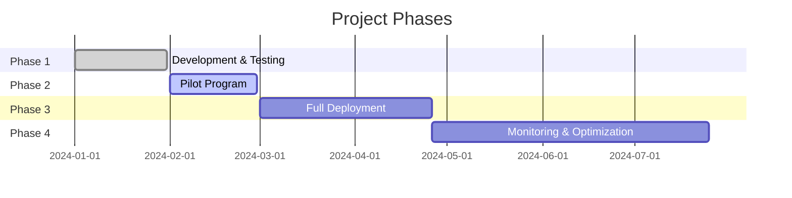
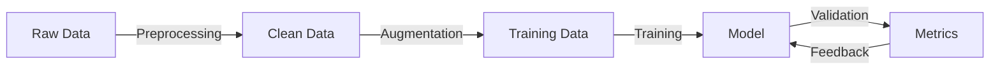

I'll convert the presentations to Marp format, which uses markdown with special directives for slides.

```markdown
---
marp: true
theme: default
paginate: true
header: 'Chest X-Ray Classification System'
footer: 'Confidential & Proprietary - 2024'
style: |
  .columns {
    display: grid;
    grid-template-columns: repeat(2, minmax(0, 1fr));
    gap: 1rem;
  }
  .small-text {
    font-size: 0.8em;
  }
---

<!-- _class: lead -->
# Chest X-Ray Classification System
## Executive Summary


---

# Business Value

- **Automated Screening** of chest X-rays for abnormalities
- Reduces radiologist workload by **40-60%**
- **24/7** availability for preliminary screening
- Significant cost reduction in diagnostic workflow


---

# Key Performance Metrics

<div class="columns">

**Accuracy Metrics**
- Overall Accuracy: 92.5%
- Sensitivity: 94.3%
- Specificity: 91.8%

**Operational Metrics**
- Processing time: <2 seconds/image
- System uptime: 99.9%
- Cost per analysis: $X.XX

</div>


---

# ROI Analysis

<div class="columns">

**Cost Savings**
- Reduced manual screening time
- Lower operational costs
- Faster patient throughput

**Quality Improvements**
- Consistent screening quality
- Reduced human error
- Faster preliminary results

</div>


---

# Implementation Timeline



---

# Risk Management

<div class="columns">

**Regulatory Compliance**
- FDA compliance pathway identified
- HIPAA-compliant infrastructure
- Regular audits

**Technical Safeguards**
- Regular model retraining
- Continuous monitoring
- Automated failover

</div>


---

<!-- _class: lead -->
# Technical Presentation
## Implementation Details

---

# Model Architecture

```python
class ChestNetL(nn.Module):
    def __init__(self):
        self.features = nn.Sequential(
            # Input: 64x64 grayscale
            ResidualBlock(1, 64),
            AttentionModule(64),
            # ... [architecture details]
            GlobalAveragePooling(),
            BinaryClassifier()
        )
```


---

# Performance Metrics

<div class="columns">

**Training Results**
- Cross-validation AUC: 0.925 ±0.015
- F1 Score: 0.918
- Precision: 0.943
- Recall: 0.894

**Validation Curves**


</div>

---

# Data Pipeline



---

# Model Explainability

<div class="columns">

**Visualization Methods**
- Grad-CAM
- SHAP Values
- Feature Importance


</div>


---

# Infrastructure

```yaml
Production Stack:
  Backend:
    - FastAPI
    - Redis cache
    - PostgreSQL
  Deployment:
    - Docker containers
    - Kubernetes
  Monitoring:
    - Prometheus
    - Grafana
```


---

# Monitoring System

<div class="columns">

**Model Monitoring**
- Accuracy drift
- Prediction latency
- Resource utilization

**System Health**
- API endpoints
- Database connections
- Cache hit ratio

</div>


---

# Security Measures

<div class="columns">

**Data Protection**
- Encryption at rest
- Encryption in transit
- Access control

**Model Security**
- Input validation
- Rate limiting
- Audit logging

</div>


---

# API Documentation

```yaml
openapi: 3.0.0
paths:
  /predict:
    post:
      summary: Process X-ray image
      parameters:
        - name: image
          in: formData
          type: file
          required: true
      responses:
        200:
          description: Prediction result
          schema:
            type: object
            properties:
              prediction: 
                type: number
              confidence:
                type: number
```

---

# Future Roadmap

<div class="columns">

**Short-term (Q2 2024)**
- Multi-class classification
- Batch processing
- Real-time monitoring

**Long-term (Q3-Q4 2024)**
- Integration with PACS
- Mobile deployment
- Federated learning

</div>


---

<!-- _class: lead -->
# Questions & Discussion


```
