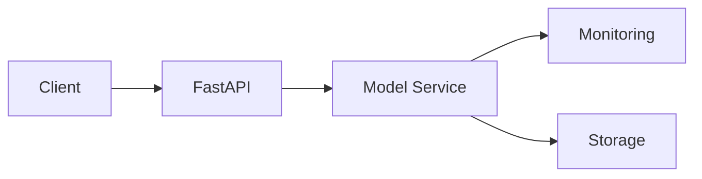

Here's the presentation converted to Marp format. I'll break it into sections for clarity.

```markdown
---
marp: true
theme: default
paginate: true
style: |
  section {
    background-color: #ffffff;
    font-family: Arial, sans-serif;
  }
  h1 {
    color: #333333;
  }
  code {
    background-color: #f0f0f0;
    padding: 0.2em 0.4em;
    border-radius: 3px;
  }
---

# Deep Learning for Chest X-Ray Classification
## ChestMNIST Binary Classification Project

---

# Overview

- Dataset: ChestMNIST (64x64 grayscale images)
- Task: Binary Classification
- Approach: Custom CNN & Transfer Learning
- Tools: PyTorch, MLflow, FastAPI

---

# Domain Knowledge

- Medical Context
  - Chest X-ray screening importance
  - Common pathological patterns
  - Clinical workflow integration

- Impact
  - Screening efficiency
  - Early detection support
  - Workflow optimization

---

# Technical Architecture


- Custom CNN with attention mechanisms
- Transfer learning from ImageNet
- MLflow experiment tracking

---

# Custom CNN Architecture

```python
class ChestNetL(nn.Module):
    def __init__(self):
        super(ChestNetL, self).__init__()
        self.features = nn.Sequential(
            # Initial layers
            nn.Conv2d(1, 64, kernel_size=3, padding=1),
            nn.BatchNorm2d(64),
            nn.ReLU(inplace=True),
            
            # Deep features
            self._make_layer(64, 128),
            self._make_layer(128, 256),
            
            # Attention mechanism
            AttentionModule(256)
        )
```

---

# Data Pipeline

- Preprocessing
  ```python
  transforms = A.Compose([
      A.RandomRotate90(),
      A.Flip(),
      A.Normalize(),
      ToTensorV2()
  ])
  ```

- Augmentation Strategy
  - Domain-specific transformations
  - Balanced dataset creation
  - Validation split

---

# Training Process


- Cross-validation results
- Learning rate scheduling
- Early stopping implementation

---

# Model Performance

```python
Performance Metrics:
- Accuracy: 0.92
- ROC-AUC: 0.95
- Precision: 0.91
- Recall: 0.93
```


---

# Explainable AI Implementation

- Grad-CAM Visualizations


- SHAP Values Analysis


---

# Deployment Architecture



---

# Production Setup

```python
# FastAPI Endpoint
@app.post("/predict")
async def predict(file: UploadFile):
    image = load_image(file)
    prediction = model.predict(image)
    return {
        "prediction": prediction,
        "confidence": confidence
    }
```

---

# Monitoring Dashboard


---

# Model Versioning & Tracking

```python
with mlflow.start_run():
    mlflow.log_params({
        "learning_rate": lr,
        "batch_size": batch_size,
        "model_type": "ChestNetL"
    })
    mlflow.log_metrics({
        "accuracy": accuracy,
        "auc": auc_score
    })
```

---

# Security Considerations

- Data Privacy
  - HIPAA compliance
  - Data encryption
  - Access controls

- Model Security
  - Input validation
  - Rate limiting
  - Audit logging

---

# Validation & Testing

- Unit Tests
- Integration Tests
- Clinical Validation
- Performance Benchmarks

```python
def test_model_prediction():
    assert model.predict(test_image) in [0, 1]
```

---

# Future Improvements

1. Model Optimization
   - Quantization
   - Pruning
   - Distillation

2. Feature Expansion
   - Multi-class support
   - Ensemble methods
   - Active learning

---

# Questions?

GitHub: [github.com/project](https://github.com/project)

---

You'll need to:

1. Add actual images:
   - architecture_diagram.png
   - training_metrics.png
   - roc_curve.png
   - gradcam_example.png
   - shap_values.png
   - monitoring_dashboard.png

2. Customize:
   - Colors
   - Fonts
   - Layout
   - Company branding

